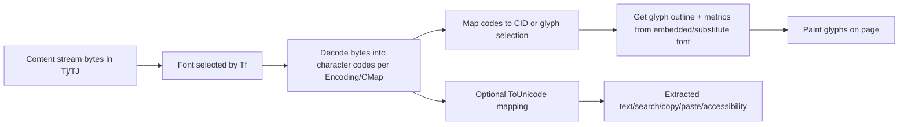
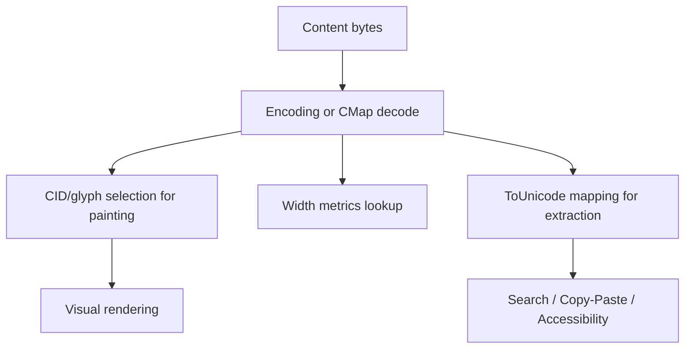
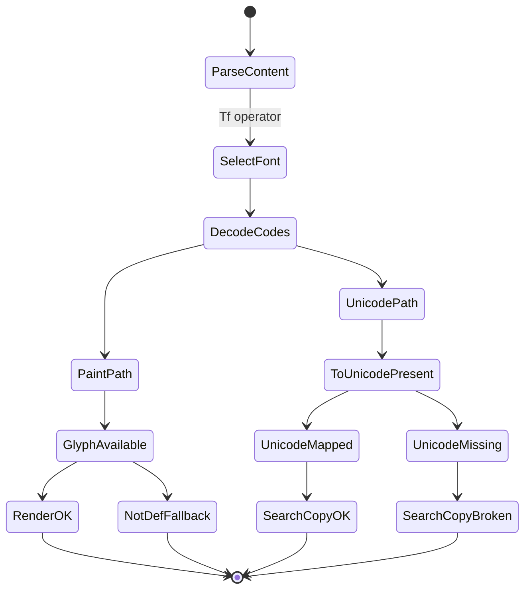

# PDF Fonts Deep Dive: Rendering, Encoding, CID, ToUnicode, Embedding, Subsetting

This document explains PDF font behavior from first principles and maps those concepts to the diagnostics used in this project.

It is intentionally detailed. PDF text/font behavior is one of the most complex areas of the format, and many bugs come from mixing up distinct layers (code bytes, glyph IDs, Unicode text, shaping, and rendering).

---

## 1) The core model: PDF does **not** store “characters” directly

At content-stream level, PDF text operators (`Tj`, `TJ`) send **font-specific character codes** (byte sequences) to a selected font resource. Those codes are interpreted through font dictionaries/encodings/CMaps to pick glyph programs and advance widths.

There are several different “spaces” involved:

1. **Content-stream code space**  
   The raw bytes in `Tj`/`TJ` strings.
2. **PDF character code space**  
   1-byte, 2-byte, or variable-width character codes interpreted per font/CMap.
3. **CID or glyph-id related space**  
   For composite fonts (Type 0), character codes map to CIDs.
4. **Glyph program space**  
   Actual outlines (TrueType/OpenType/CFF, Type1 charstrings, Type3 procedures).
5. **Unicode text space**  
   Optional/recommended mapping used for extraction/search/accessibility (`ToUnicode`).

If these spaces are conflated, diagnostics become misleading.

---

## 2) Rendering pipeline (conceptual)



Important: rendering can succeed even when `ToUnicode` is wrong or missing, because rendering and extraction are not the same path.

---

## 3) “Real missing glyphs” vs “mapping missing”

These are different failure classes.

## 3.1 Real missing glyphs (visual/rendering problem)

A **real missing glyph** means the renderer cannot draw the intended shape because the active font program lacks it (or fallback/substitution fails). Symptoms:

- tofu boxes / empty squares / `.notdef`
- wrong fallback glyph
- width advances without meaningful shape

Root causes:

- font subset omitted needed glyph
- non-embedded font unavailable on target system
- wrong code-to-glyph mapping (`Encoding`/CMap mismatch)
- composite/descendant font mismatch

This is a **paint path** problem.

## 3.2 Missing Unicode mapping (text extraction problem)

A font/code can render fine but still have no reliable Unicode mapping for extraction if `ToUnicode` is absent/broken.

Symptoms:

- copy/paste garbage or blanks
- search fails
- accessibility text poor

This is an **interpretation/extraction** problem.

## 3.3 Why this matters for diagnostics

A single counter like “missing glyph chars” can be interpreted in at least two ways:

1. missing **renderable glyph shape** (paint failure), or
2. missing **Unicode mapping** (extraction failure).

Those are related but not equivalent.

---

## 4) What “font with explicit empty ToUnicode map” means

A font dictionary may contain a `ToUnicode` entry pointing to a CMap stream that declares code space but has **no `bfchar`/`bfrange` mappings**.

Conceptually:

- `ToUnicode` key exists (`hasToUnicode = true`)
- but mapping table is functionally empty

This can happen in malformed PDFs or synthetic test cases.

Why it is tricky:

- some libraries may still infer Unicode from other font internals (or identity assumptions)
- strict semantic interpretation says “explicit map is empty => no authoritative Unicode mapping”

So behavior can differ between tools.

---

## 5) What was the “semantic hack” in our recent test work

In our recent iteration, the analyzer was changed to treat an explicit empty `ToUnicode` map as **force-unmapped** for diagnostics.

That helps create deterministic “missing mapping” test outcomes, but it is a policy choice, not a pure observation of renderability.

Why it can be called a semantic hack:

- it collapses nuanced runtime behavior into a hard rule
- it can classify cases as unmapped even when a library fallback can still return Unicode
- it may overfit tests if the test setup does not represent real production PDFs

So this rule is useful for certain quality policies, but must be documented as policy.

---

## 6) CID fonts, Type 0 fonts, and `Identity-H`

## 6.1 Simple vs composite font families in PDF

- **Simple fonts**: Type1, TrueType, Type3, MMType1  
  Usually limited character code model (often 1-byte encoding style, practical limits for direct code space).
- **Composite fonts**: Type0 + descendant CIDFont (CIDFontType0 or CIDFontType2)  
  Designed for large character sets (CJK and beyond), with CMap-based code decoding.

## 6.2 CID basics

**CID** = Character Identifier used in CID-keyed fonts.  
The character code in content stream is decoded by CMap into CID values; the CID then indexes glyph selection/metrics in descendant font data.

## 6.3 `Identity-H` and `Identity-V`

- `Identity-H`: horizontal writing identity mapping
- `Identity-V`: vertical writing identity mapping

With `Identity-H`, content bytes are interpreted directly into code units under an identity-style CMap convention (commonly 2-byte code patterns in Type0 usage), and mapped to descendant CID space.

Key point: `Identity-H` is about code interpretation in composite fonts, not a guarantee of correct Unicode extraction. `ToUnicode` is still needed for reliable Unicode semantics.

---

## 7) Encoding/CMap/ToUnicode: different jobs



- **Encoding/CMap**: decode content codes for rendering path.
- **ToUnicode**: decode content codes into Unicode text semantics.

They can disagree; rendering may look fine while extraction is broken.

---

## 8) Font technologies and PDF wrappers

PDF wrapper type is not the same as source font technology.

Typical pairings:

- Type1 wrapper with Type1 charstrings
- TrueType simple font wrapper with TrueType outlines
- Type0 wrapper with CIDFontType2 descendant (TrueType outlines)
- Type0 wrapper with CIDFontType0 descendant (CFF outlines)
- Type3 wrapper with content-stream glyph programs (procedural glyphs)

OpenType can carry TrueType or CFF outlines, and in PDF it is represented through corresponding PDF font constructs.

---

## 9) Embedded vs non-embedded fonts

## 9.1 Embedded

Font program data included in PDF. Better reproducibility.

## 9.2 Non-embedded

Viewer substitutes from system fonts. Risks:

- metric mismatch (layout drift)
- glyph differences
- unavailable script coverage

---

## 10) Full embedding, subsetting, and partial embedding nuance

## 10.1 Full embedding

Whole font program included.

## 10.2 Subset embedding

Only used glyphs included; font name usually prefixed like `ABCDEE+FontName`.

Benefits:

- smaller file size

Risks:

- later edits requiring new glyphs fail unless font expanded/re-embedded

## 10.3 “Partial embedding” terminology

In practice this usually means subset embedding, but people sometimes also mean:

- incomplete tables needed by some viewers
- missing glyphs for codes that appear later
- mixed subset resources across pages

So always clarify whether partial means intentional subset vs malformed/incomplete embed.

---

## 11) Tiny but crucial distinctions

1. **Code used** vs **Unicode extracted**  
   A used code may map to no Unicode while still painting something.
2. **Glyph count** vs **distinct used codes**  
   Same code repeated many times inflates glyph count.
3. **Mapped used codes** vs **real glyph availability**  
   `toUnicode` mapping success does not guarantee glyph quality.
4. **CID identity mapping** vs **semantic text correctness**  
   Identity CMaps aid decoding for rendering but do not equal linguistic correctness.

---

## 12) Common variants and combinations

| Wrapper | Descendant/Outline | Decode path | ToUnicode state | Typical result |
|---|---|---|---|---|
| Type1 | Type1 charstrings | Encoding | Good | Render + extract usually good |
| Type1 | Type1 | Encoding | Missing | Render maybe good, extract weak |
| TrueType (simple) | TrueType | Encoding | Good | Good for Latin-centric docs |
| Type0 | CIDFontType2 (TT) | CMap (`Identity-H` common) | Good | Strong for large charset |
| Type0 | CIDFontType2 | CMap | Missing/empty | Render may work, extract uncertain |
| Type0 | CIDFontType0 (CFF) | CMap | Good | Good if complete mappings exist |
| Type3 | Procedural glyphs | CharProcs | Often weak | Rendering custom; extraction tricky |
| Any non-embedded | System substitute | Viewer dependent | Any | Non-deterministic across systems |

---

## 13) Why Adobe Reader and analysis tools may disagree

- Adobe may merge/display fonts by base name in UI, while internal objects differ.
- Your analyzer may report per-object diagnostics (`objNum:genNum`).
- Some tools infer Unicode via heuristics when `ToUnicode` is weak.
- Viewer rendering uses fallback/substitution not reflected identically in extraction APIs.

Thus “not visible as a distinct font name” does not prove no additional font object exists.

---

## 14) Diagnostics terms in this project (current semantics)

From `FontDiagnostics` and `FontInspectorService`:

- `distinctUsedCodes`: number of distinct character codes seen for that font in text positions.
- `mappedUsedCodes`: used codes for which `toUnicode(code)` returned non-empty (or policy-adjusted behavior).
- `unmappedUsedCodes`: used codes with no Unicode mapping.
- `unencodableUsedChars`: currently aligned to unmapped used codes in this branch’s logic.
- `missingUsedGlyphMappings`: list of used codes lacking Unicode mapping in detail view.

Important: these are code-to-Unicode diagnostics, not a complete proof of rasterized visual glyph success.

---

## 15) Practical debugging checklist for font issues

1. Verify whether issue is rendering, extraction, or both.
2. Inspect font object (`Subtype`, `BaseFont`, embedding flags, descendant font).
3. Inspect `Encoding` and `ToUnicode` objects directly.
4. Compare used code list against glyph mapping table.
5. Check subset prefix and whether expected glyphs are included.
6. Test on multiple viewers (Adobe, browser PDF, PDFBox extraction).
7. Avoid relying only on display font name; track object number/generation.

---

## 16) Minimal object snippets (illustrative)

Type0 font skeleton:

```pdf
<<
  /Type /Font
  /Subtype /Type0
  /BaseFont /ABCDEE+MyFont
  /Encoding /Identity-H
  /DescendantFonts [ 25 0 R ]
  /ToUnicode 30 0 R
>>
```

CIDFont descendant skeleton:

```pdf
<<
  /Type /Font
  /Subtype /CIDFontType2
  /BaseFont /ABCDEE+MyFont
  /CIDSystemInfo << /Registry (Adobe) /Ordering (Identity) /Supplement 0 >>
  /FontDescriptor 26 0 R
  /W [ ...width arrays... ]
>>
```

---

## 17) About tests: robust strategy (recommended)

For deterministic tests, avoid assertions based only on font display names.

Prefer:

- assert per object id (`objNum/genNum`)
- assert concrete used-code sets
- assert glyph mapping table entries for those codes
- separate tests for:
  - renderability assumptions
  - Unicode extraction assumptions

This avoids semantic drift where a test passes because of policy shortcuts rather than intended document behavior.

---

## 18) One-page summary

- PDF text uses codes, not direct Unicode.
- Rendering and extraction are separate pipelines.
- `Identity-H`/CID solve large code-space addressing, not semantic text by themselves.
- `ToUnicode` is central for reliable extraction/accessibility.
- Subsets reduce size but can create missing-glyph surprises after edits.
- “Empty `ToUnicode`” is a special case that needs explicit policy; it is not automatically equivalent to visual missing glyphs.

---

## 19) Extended rendering state diagram



This makes it explicit that visual and textual outcomes can diverge.
